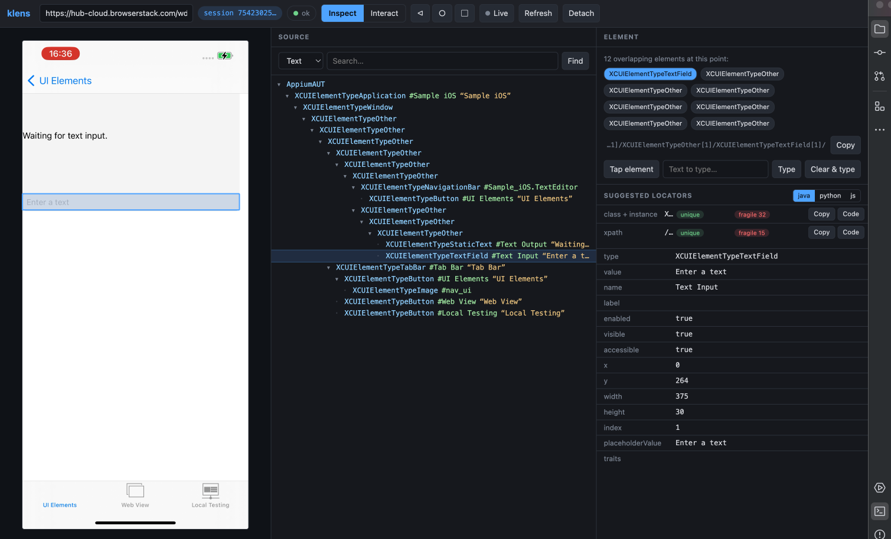

<p align="center">
  <picture>
    <source media="(prefers-color-scheme: dark)" srcset="assets/logo-dark.png" />
    
  </picture>
</p>

<p align="center">
  A mobile UI inspector for <b>Android &amp; iOS</b>, powered by Appium —<br/>
  a desktop app for macOS &amp; Windows, with built-in cloud device support.
</p>

<p align="center">
  <a href="https://github.com/kadiratali/klens/releases/latest"></a>
  <a href="https://github.com/kadiratali/klens/releases"></a>
  
  
  <a href="LICENSE"></a>
</p>

---

**klens** is an Appium-based inspector for mobile apps — like Appium Inspector,
but with sharper element matching, resilient sessions, and a locator engine that
tells you **which selector is robust and why**. Point it at a local emulator or a
cloud device (BrowserStack) and inspect, tap, type, and generate locators.

<p align="center">
  
</p>

## ✨ Why klens

- **Locator robustness scoring** — every suggested selector gets a `robust` /
  `moderate` / `fragile` rating (0–100) with reasons: it flags compiler-generated
  ids, dynamic/dated text, and index-based fragility. *Appium Inspector suggests
  locators; klens tells you which one will survive the next build.*
- **Smarter hit-testing** — clicks match the **smallest bounding box**, not the
  deepest node, so overlays and full-screen containers resolve correctly. Every
  overlapping candidate at a point is listed and switchable.
- **Resilient by design** — when a session dies (UiAutomator2 / WDA crash) it
  **auto-reconnects** with backoff, preserving your tree and selection.
- **Live mode** — adaptive polling follows the device hands-free; near-zero
  traffic while the screen is idle.
- **Cloud-ready** — connect a **BrowserStack** account in two clicks and inspect
  real cloud devices, no local Appium needed.
- **Cross-platform** — one app for Android and iOS, on macOS and Windows.

## ⬇️ Download

Grab a prebuilt installer from the [**Releases**](https://github.com/kadiratali/klens/releases) page:

| Platform | File |
| --- | --- |
| **macOS** (Intel + Apple Silicon) | `klens-<version>-universal.dmg` |
| **Windows** | `klens-Setup-<version>.exe` |

> **First launch (unsigned builds):** the app is not code-signed yet, so the OS
> blocks it once.
> - **macOS** — click **Done** on the warning, then **System Settings → Privacy &
>   Security → Open Anyway**. (Or run `xattr -dr com.apple.quarantine /Applications/klens.app`.)
> - **Windows** — SmartScreen → **More info → Run anyway**.

The app bundles its own Appium proxy server, so **no separate Node install is
needed** — you only need a running Appium server (local) or a cloud account.

## 🚀 Getting started

1. Launch klens and point it at a device:
   - **Local** — enter your Appium URL (default `http://127.0.0.1:4723`), then
     **List sessions → Attach**, or **New session…** with a capabilities JSON.
   - **Cloud** — click **☁ Cloud → BrowserStack**, enter your username + access
     key, then **New session…** with your `bs://` app and device caps.
2. **Refresh** (or toggle **Live**) to capture the screen + hierarchy.
3. Click any element to inspect it, read its attributes, and copy a **suggested
   locator** (with a robustness badge) as a one-line Java / Python / JS snippet.

## 🧭 Features

- **Inspect / Interact modes** (`i`) — inspect selects elements; interact sends
  real taps, drags become swipes, and a long hold is a long-press. Type text into
  a field (Type / Clear & type), plus Android back / home / recents keys. The view
  auto-refreshes after every action.
- **Search** — find elements by Text / ID / XPath; matches are highlighted in the
  tree and on the screenshot.
- **Suggested locators** — accessibility-id, resource-id, text, class+instance,
  and an optimized short XPath, each validated for uniqueness against the current
  snapshot (no device round-trip) and ranked by robustness.
- **Live mode** (`l`) — non-overlapping adaptive polling that follows the device
  and quiets down when idle.
- **Cloud providers** — BrowserStack today; the picker lists more (coming soon).

## ☁️ Cloud devices (BrowserStack)

1. **☁ Cloud → BrowserStack** → enter your username + access key (stored locally).
2. Upload an app to BrowserStack to get a `bs://` id:
   ```sh
   curl -u "USER:KEY" -X POST "https://api-cloud.browserstack.com/app-automate/upload" \
     -F "file=@/path/to/app.apk"
   ```
3. **New session…** with cloud caps, e.g.:
   ```json
   {
     "platformName": "android",
     "appium:automationName": "UiAutomator2",
     "appium:app": "bs://<app-id>",
     "bstack:options": { "deviceName": "Samsung Galaxy S23", "osVersion": "13.0" }
   }
   ```
Credentials are sent as HTTP Basic auth and injected into `bstack:options`; they
never leave your machine except to BrowserStack.

## 🛠️ Run from source

```sh
npm install
npm run dev          # server + web in the browser (http://localhost:5173)
npm run dev:desktop  # server + web + Electron window (desktop)
```

Environment variables: `APPIUM_URL` (default `http://127.0.0.1:4723`),
`PORT` (backend, default `3100`).

## 📦 Build & release

```sh
npm run dist   # web build + server bundle + electron-builder → desktop/dist/
```

Pushing a `v*` tag triggers `.github/workflows/release.yml`, which builds macOS
and Windows installers on their runners and publishes them to GitHub Releases:

```sh
git tag v0.1.0 && git push origin v0.1.0
```

## 🔍 How it works

- **`server/`** — Node + Express (port 3100), proxying to Appium over W3C REST
  (no WebdriverIO). One `GET /api/inspect` returns a race-guarded screenshot +
  hierarchy, and **incremental diffs** between refreshes (only `added/removed/changed`).
  A health loop pings the session every 4s and drives auto-reconnect. Interaction,
  locator, and search endpoints live under `/api/action/*`, `/api/locators`, `/api/search`.
- **`web/`** — Vite + React. Screenshot + XML tree + detail panels; a node's
  identity is its XPath, so selection survives refreshes.
- **`desktop/`** — an Electron shell that reuses the same server + UI. Packaged
  builds bundle the server (via `esbuild`) and `web/dist` as resources and run on
  a single port; no separate Node needed.

See [ROADMAP.md](ROADMAP.md) for what's built and what's next.

## Notes

- **Coordinate spaces** — Android (uiautomator2) reports `bounds` in pixels
  (1:1 with the screenshot); iOS (XCUITest) reports points, scaled proportionally
  via the hierarchy's total bounding box.
- **iOS** — inspect, tap, and text entry are verified on BrowserStack; iOS-specific
  locator strategies (class chain / predicate) are on the roadmap.
